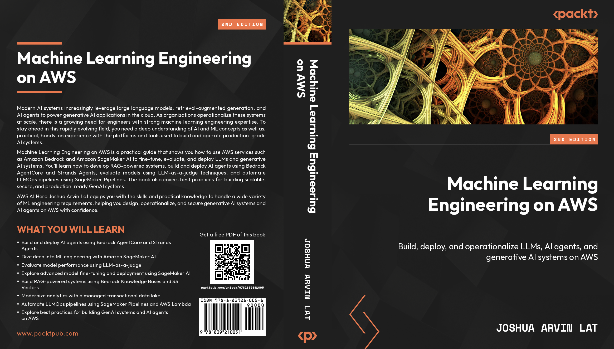

# Machine Learning Engineering on AWS — Second Edition Build, deploy, and operationalize LLMs, AI agents, and generative AI systems on AWS

Welcome to the official GitHub account for *Machine Learning Engineering on AWS — Second Edition* by [Joshua Arvin Lat](https://www.amazon.com/author/arvs), published by Packt. Here you'll find the repositories and Gists referenced throughout the [book](https://www.packtpub.com/en-us/product/machine-learning-engineering-on-aws-9781835881088).

This book is for AI engineers, data scientists, machine learning engineers, and technology leaders who want to deepen their understanding of machine learning engineering, generative AI, large language models, retrieval-augmented generation, AI agents, and MLOps on AWS. A foundational understanding of artificial intelligence, machine learning, generative AI, and cloud engineering concepts is recommended.

A lot has changed since I wrote the first edition of this book. Back then, generative AI was still emerging, and many organizations were only beginning to explore how large language models (LLMs) could change the way we build machine learning systems and workflows. Today, generative AI has become a core part of real-world applications, which means building modern AI systems now requires much more than just training models. It also involves production engineering, LLMOps automation, security, evaluation, and scalable cloud-based architectures. In this second edition, I want to help you understand how these modern AI systems are built on AWS through practical, hands-on examples covering generative AI, AI agents, data engineering, model deployment, evaluation, and automation, so you can confidently design and operate production-ready AI solutions.

## Where to Get Your Copy

You can secure your copy of *Machine Learning Engineering on AWS — Second Edition* from major online retailers such as [Amazon](https://amazon.com/author/arvs) or directly from the publisher, [Packt](https://www.packtpub.com/en-us/product/machine-learning-engineering-on-aws-9781835881088). Choose the format that works best for you. 🙏

## Chapter 1: A Gentle Introduction to Generative AI and AI Agents on AWS

In this chapter, you'll explore the fundamentals of generative AI on AWS and learn how to use various services and solutions to build AI agents. You will work with foundation models provided through Amazon Bedrock, cover key concepts and terminology, set up a SageMaker Studio space, and build your first AI agent using Strands Agents with tool integrations to enhance reasoning and problem-solving capabilities.

## Chapter 2: Building AI Agents with SageMaker AI and Bedrock AgentCore

In this chapter, you'll learn how to build AI agents that interact with a SageMaker AI real-time inference endpoint. You will use Amazon Bedrock Knowledge Bases and Amazon S3 Vectors to build retrieval-augmented generation powered agents, while also exploring how Strands Agents and Bedrock AgentCore can integrate model inference, external tools, and knowledge retrieval into production-ready agent-based systems.

## Chapter 3: Machine Learning Engineering with Amazon SageMaker AI

In this chapter, you'll learn the fundamentals of machine learning engineering on AWS and use Amazon SageMaker AI to implement end-to-end machine learning workflows. You will train and deploy an XGBoost model, fine-tune a BERT model, and explore how SageMaker AI simplifies training, inference, and model lifecycle management through managed capabilities.

## Chapter 4: Modernizing Analytics with a Managed Transactional Data Lake

In this chapter, you'll build and work with a transactional data lake using Amazon S3 tables. You will create an Amazon S3 table bucket, launch an Amazon EMR cluster with Apache Iceberg, run queries using Apache Spark, and explore time travel queries to analyze how datasets evolve over time.

## Chapter 5: Practical Data Management on AWS

In this chapter, you'll explore AWS services and capabilities that support data management for analytics and machine learning workloads. You will work with AWS Lake Formation permissions, query data using Amazon Athena, ingest data into Amazon SageMaker Feature Store, and retrieve data from both the online and offline feature stores.

## Chapter 6: Pragmatic Data Processing on AWS

In this chapter, you'll learn how to use SageMaker Processing jobs for resource-intensive data processing workloads. You will run a back-translation workflow using SageMaker Processing, prepare datasets and scripts, and explore best practices for designing, managing, scaling, and securing data processing workflows.

## Chapter 7: SageMaker AI Model Training and Tuning Capabilities

In this chapter, you'll fine-tune a large language model using Amazon SageMaker AI as part of an end-to-end machine learning workflow. You will track experiments using MLflow, execute supervised fine-tuning jobs, perform hyperparameter tuning to identify the best-performing model, and deploy the final model to a real-time inference endpoint.

## Chapter 8: SageMaker AI Model Deployment Options and Strategies

In this chapter, you'll explore different deployment options and strategies in Amazon SageMaker AI. You will deploy models using real-time, serverless, asynchronous, and batch inference options, while also practicing advanced deployment techniques such as shadow testing, canary traffic shifting, and inference data capture for monitoring and evaluation.

## Chapter 9: Automating LLMOps Workflows with SageMaker Pipelines

In this chapter, you'll design and operationalize LLMOps pipelines using SageMaker Pipelines. You will build single-step and multi-step workflows, integrate AWS Lambda-based orchestration steps, and learn best practices for building scalable, maintainable, secure, and cost-efficient production-grade machine learning pipelines.
